# Recovering Deleted Files - Forensics :detective:

* Did you know that even deleting a file from a device, it remains accessible? Did you know that we can recover this data? With this concept of file recovery, we can also mention the problems of leakage and unauthorized data access when a **HD/SSD/PENDRIVE** is discarded incorrectly. The people who may be looking for this data are called **Dumpster Diving**.

> [!IMPORTANT]
The **Dumpster diving** is looking for treasure in someone else's trash. In the world of information technology (IT), dumpster diving is a technique used to retrieve information that could be used to carry out an attack or gain access to a computer network from disposed items.

  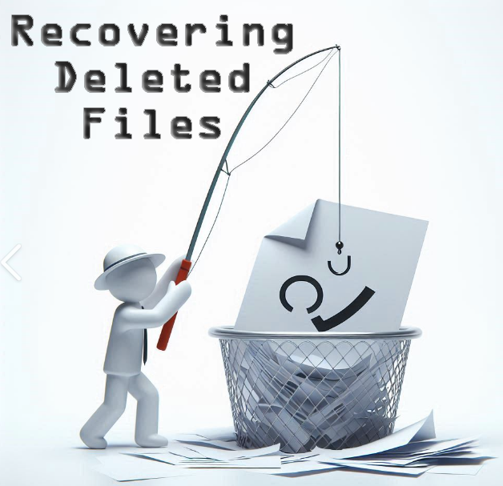

* In this document we will use one of the forensic techniques used to recover and analyze system files. For the study, we will **Create** and **Remove** files on drive 'E:', below.

  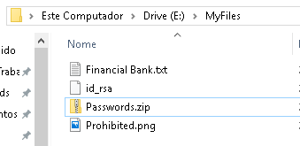

# What will we use :question:

* In our study we will use 2 programs, one to create an image of the target disk and the other to analyze this data.

    * **FTK Imager** - FTK Imager es una herramienta gratuita de análisis forense digital. Cuenta con funciones específicas para la adquisición de evidencia derivada de unidades de almacenamiento. En este caso, utilizaremos la versión para Windows, disponible en[FTK Imager](https://www.exterro.com/ftk-product-downloads/ftk-imager-version-4-7-1)

    

        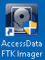
    

    * **Autopsy** -Autopsy es una herramienta para el personal de primera respuesta cibernética en casos de intrusiones, escenas de crímenes y zonas de guerra. Se utilizará junto con FTK para analizar los datos generados. Está disponible para Windows.e [Autopsy](https://www.autopsy.com/download/)

    

        
    

    
# Disk Image :cd:

* Un archivo de imagen de disco contiene una copia bit a bit de una unidad de disco. Una copia bit a bit guarda todos los datos de un archivo de imagen de disco, incluidos los metadatos, en un solo archivo. Para este paso, usaremos **FTK Imager**.

1. Vaya a 'Archivo -> Crear imagen de disco'.

    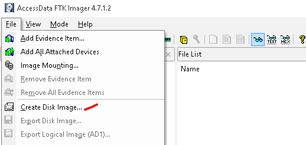

2. SetSeleccionar 'Logical Driver'.
 

    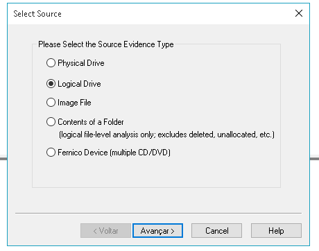

3. Selecionar el Drive.
 

    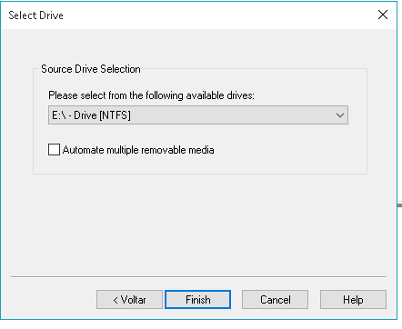

4. Selecione  type 'E01', this type will be imported into autopsy.
 

    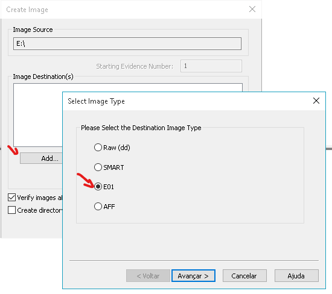

5. Registrar la evidencia; esta información no es necesaria. En Destino, se indica dónde se guardará el registro.
 

    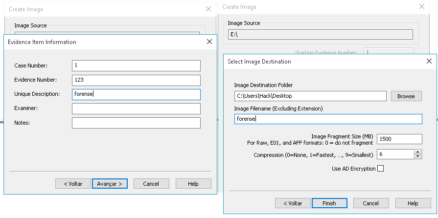

6. Generación de la imágen **forense.E01**.
 

    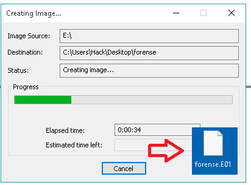

# Recovering the Files :floppy_disk:

* Después de generar los archivos de evidencia con FTK Imager, podemos analizar y recuperar los archivos eliminados con Autopsy. ¡Vamos!

1. Crear un nuevo caso'new case'.
 

    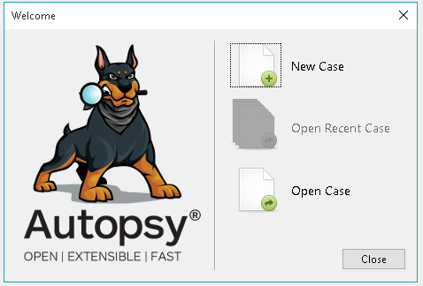

2.Generar datos solicitados sobre el caso.
 

    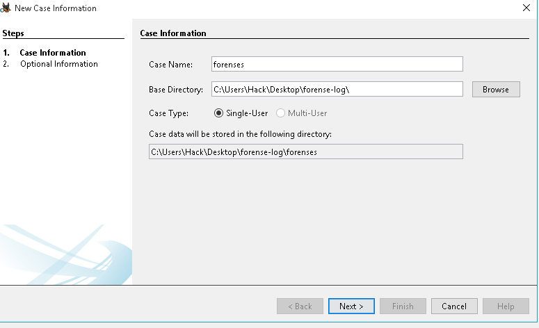

3. Aquí seleccionaremos una imagen de disco..
 

    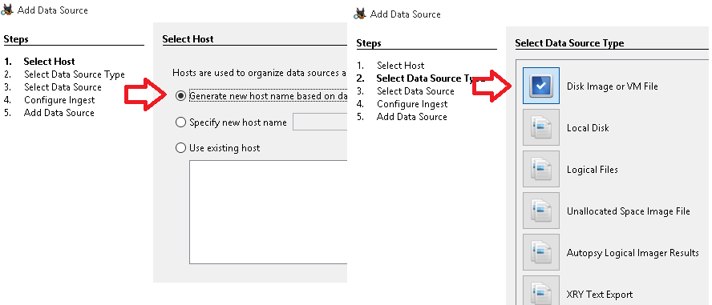

4. Selecionar el archivo E01.
 

    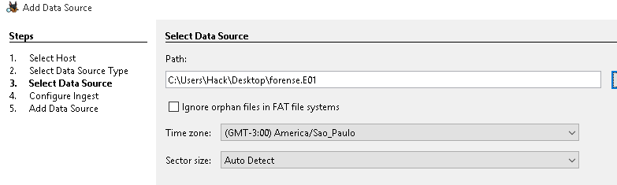

5. Aquí podemos ver todos nuestros archivos eliminados.
 

    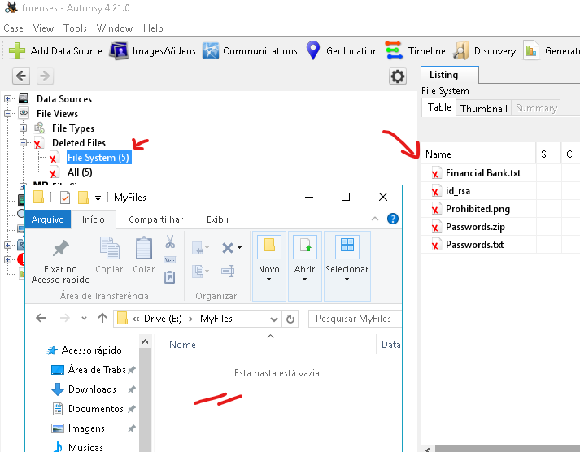

6. Al extraer los archivos pudimos acceder nuevamente a todos los archivos.
 

    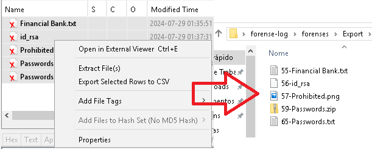

# Evidencia Final :mag:

* Below we were able to open all the files that were deleted on our disk E:.

 

    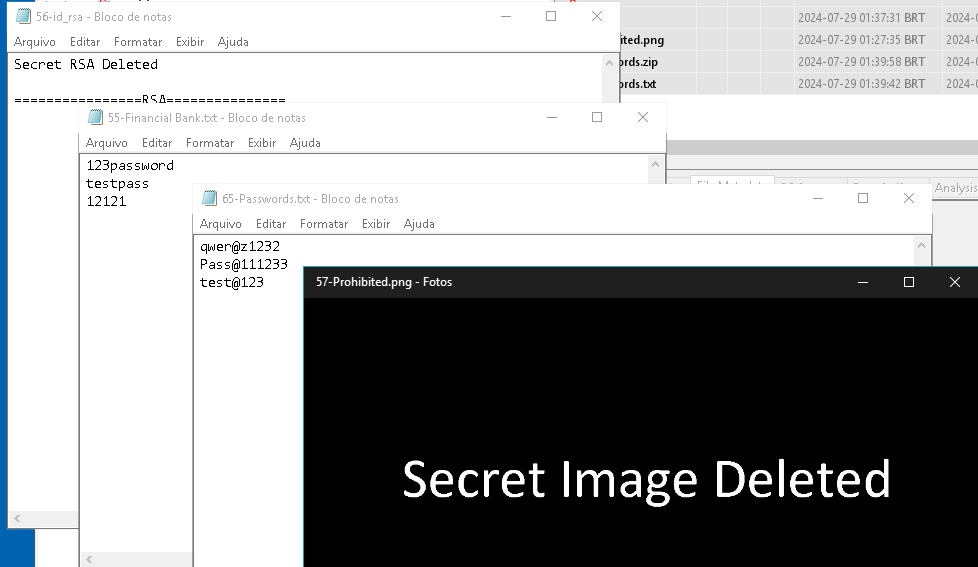

